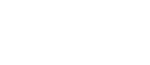
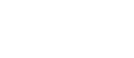
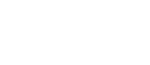
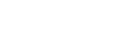

# Assorted

## MAE/MFE

| long | short |
| ---- | ---- |
|  |  |
|  |  |

### Links

- [https://www.tradingdiarypro.com/mae-mfe-explained/](https://www.tradingdiarypro.com/mae-mfe-explained/)
- [https://ramblingquant.com/2018/12/14/entry-efficiency/](https://ramblingquant.com/2018/12/14/entry-efficiency/)

### Notes

Position MFE – the maximum interim profit during the trade. Usually referred to as Maximum Favorable Excursion, and sometimes referred to as runup.
Position MAE – the maximum interim loss during the trade. Usually referred to as Maximum Adverse Excursion, and sometimes referred to as drawdown.
Price MFE – the maximum favorable price movement during the trade, independent of position size.
Price MAE – the maximum adverse price movement, independent of position size.

For long trades:
MAEP: (MAE price – entry price) / (entry price – stop loss price)
MFEP: (MFE price – entry price) / (entry price – stop loss price)
For short trades:
MAEP: (entry price – MAE price) / (stop loss price – entry price)
MFEP:  (entry price – MFE price) / (stop loss price – entry price)

MAE - Maximum Adverse Excursion is the maximum draw down the trade had before the trade was closed.
MFE - Maximum Favorable Excursion is the maximum paper profit the trade had before the trade was closed.

MAE - Maximum Adverse Excursion is the maximum draw down the trade had before the trade was closed.
MFE - Maximum Favorable Excursion is the maximum paper profit the trade had before the trade was closed.
BSO: Best Scale Out. The closer your BSO is to the MFE, the better and more efficient your Exit strategy is… basically, not leaving too much money on the table.

MFE:
The Maximum Favorable Excursion is a term used to measure how much a trade moves in your favor, from your Entry.
So, if your entry price on a long position is 34, and for as long as the trade lasted, the market moved in your favor to a price of 35.50, this represents an MFE of 1.50 (35.50 – 34).
MAE:
The Maximum Adverse Excursion is a term used to measure how much a trade moves against you, from your Entry.
So, if your entry price on a long position is 34, and for as long as the trade lasted, the market moved against you to a low price of 33.25, this represents a MAE of .75 (34 – 33.25).

BSO:MFE-MAE traders lab diagram
Best Scale Out. The closer your BSO is to the MFE, the better and more efficient your Exit strategy is… basically, not leaving too much money on the table.
If the gap between BSO and MFE is big, then you may have an issue taking your final target too soon and not letting your winners ‘run’.

Entry Efficiency/Exit Efficiency
Displays each trade's ability to capture the maximum profit potential entry point and exit point during the trading period of  the trade.
The Entry Efficiency measures how close the entry price was to the best possible entry price during the trade.
The Exit Efficiency measures how close the exit price was to the best possible exit price during the trade.
100% is perfect efficiency, 0 is worst possible efficiency.

Entry Efficiency is Calculated as:
(maximum price seen - entry price) / (maximum price seen - minimum price seen)
= The entry took 75% of the trade range
Exit Efficiency is Calculated as:
(exit price - minimum price seen) / (maximum price seen - minimum price seen)
= The exit took 50% of the available trade range
Total Efficiency is Calculated as:
(exit price - entry price) / (maximum price seen - minimum price seen)
= The trade represented only 25% of the trade range

Efficiency is a measure of a trade quality.
It measures the percent of the total trade potential taken by a trade during the trade period.
Entry Efficiency measures the percent of the total trade potential taken by a trade given its entry and assuming the best possible exit during the trade period.
Exit Efficiency measures the percent of the total trade potential taken by a trade given its exit and assuming the best possible entry during the trade period.
Total Efficiency - Displays total efficiency for each trade number and an average total efficiency. The vertical and horizontal axes are total efficiency (%) and the trade number.
Entry Efficiency - Displays entry efficiency for each trade number and an average entry efficiency. The vertical and horizontal axes are entry efficiency (%) and the trade number.
Exit Efficiency - Displays exit efficiency for each trade number and average exit efficiency. The vertical and horizontal axes are exit efficiency (%) and the trade number.
Max Adverse Excursion (MAE) / % - A measure of the adverse movement during a trade. This graph displays for each trade, the realized profit or loss along the vertical axis. The horizontal axis shows the level of drawdown during the trade. Trades that were closed at a profit are displayed as small upward pointing green arrows. Trades that were closed at a loss are displayed as downward pointing red arrows.
Max Favorable Excursion (MFE) / % - A measure of the favorable movement during a trade. This graph displays for each trade, the realized profit or loss along the vertical axis. The horizontal axis shows the level of run-up during the trade. Trades that were closed at a profit are displayed as small upward pointing green arrows. Trades that were closed at a loss are displayed as downward pointing red arrows.

Maximum Favorable Excursion
Maximum Favorable Excursion is the peak profit before closing the trade. For example, you may have a closed trade which lost 25 pips but during the time the trade was open, it was making a 100 pips profit at some point - that was the Maximum Favorable Excursion for that particular trade.
This statistical concept originally created by John Sweeney to measure the distinctive characteristics of profitable trades, can be used as part of an analytical process to enable traders to distinguish between average trades and those that offer substantially greater profit potential.

Maximum Adverse Excursion
This is the maximum potential loss that the trade had before the trade closed in profit. For example, a trade closed with 25 points in profit but during the time it was open, at one point, it was losing 100 points - that was the Maximum Adverse Excursion for that trade.

### Links

- [https://www.tradingdiarypro.com/mae-mfe-explained/](https://www.tradingdiarypro.com/mae-mfe-explained/)
- [https://ramblingquant.com/2018/12/14/entry-efficiency/](https://ramblingquant.com/2018/12/14/entry-efficiency/)

## SMA/TRIMA/WMA Weights

| name | figure |
| ---- | ------ |
| SMA-5 |  |
| WMA-5 |  |
| TRIMA-5 |  |
| TRIMA-6 |  |
